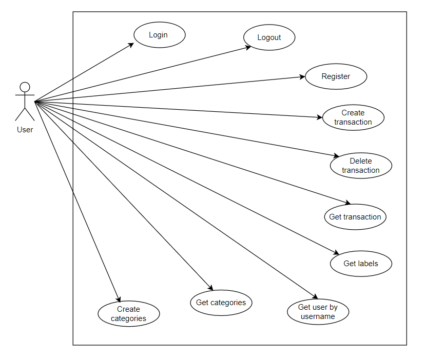
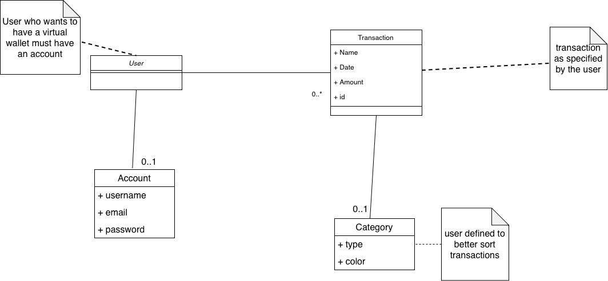
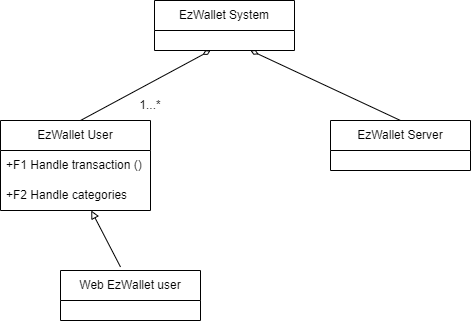

# Requirements Document - current EZWallet

Date: oggi

Version: V1 - description of EZWallet in CURRENT form (as received by teachers)

| Version number | Change |
| -------------- | :----- |
|                |        |

# Contents

- [Informal description](#informal-description)
- [Stakeholders](#stakeholders)
- [Context Diagram and interfaces](#context-diagram-and-interfaces)
  - [Context Diagram](#context-diagram)
  - [Interfaces](#interfaces)
- [Stories and personas](#stories-and-personas)
- [Functional and non functional requirements](#functional-and-non-functional-requirements)
  - [Functional Requirements](#functional-requirements)
  - [Non functional requirements](#non-functional-requirements)
- [Use case diagram and use cases](#use-case-diagram-and-use-cases)
  - [Use case diagram](#use-case-diagram)
  - [Use cases](#use-cases) + [Relevant scenarios](#relevant-scenarios)
- [Glossary](#glossary)
- [System design](#system-design)
- [Deployment diagram](#deployment-diagram)

# Informal description

EZWallet (read EaSy Wallet) is a software application designed to help individuals and families keep track of their expenses. Users can enter and categorize their expenses, allowing them to quickly see where their money is going. EZWallet is a powerful tool for those looking to take control of their finances and make informed decisions about their spending.

# Stakeholders

| Stakeholder name |                           Description                            |
| ---------------: | :--------------------------------------------------------------: |
|             User | End-users like individuals and families that use the application |

# Context Diagram and interfaces

## Context Diagram

\<Define here Context diagram using UML use case diagram>

\<actors are a subset of stakeholders>

## Interfaces

\<describe here each interface in the context diagram>

\<GUIs will be described graphically in a separate document>

| Actor | Phisical interface |                        Logical interface                        |
| ----: | :----------------: | :-------------------------------------------------------------: |
|  User |   PC/Smartphone    | GUI (manage transactions and categories, signup, login, logout) |

# Stories and personas

\<A Persona is a realistic impersonation of an actor. Define here a few personas and describe in plain text how a persona interacts with the system>

\<Persona is-an-instance-of actor>

User 1: Young adult starting living alone and managing his money  
User 2: A father of a family that wants to analyse incomes and outcomes  
User 3: Household expenses to balance and limit it  
User 4: A group of friends organizing a trip  
User 5: Student living aborad for his studies who want to reduce expenses  
User 6: Someone that has just started his worklife and saving his first paychecks  
User 7: Reriree that wants to understand how he has spent his pension

\<stories will be formalized later as scenarios in use cases>

# Functional and non functional requirements

## Functional Requirements

\<In the form DO SOMETHING, or VERB NOUN, describe high level capabilities of the system>

\<they match to high level use cases>

| ID                      |                                                         Description                                                          |
| ----------------------- | :--------------------------------------------------------------------------------------------------------------------------: |
| FR1 Manage account      | The system is capable of the following functions:login, register, logout, refresh token, show user and show user by username |
| FR2 Manage Transactions |                                  The system is able to Create, delete and show transactions                                  |
| FR3 Manage Categories   |                                       The software allow to Create and show categories                                       |

## Non Functional Requirements

\<Describe constraints on functional requirements>

| ID   | Type (efficiency, reliability, ..) |                         Description                          |       Refers to |
| ---- | :--------------------------------: | :----------------------------------------------------------: | --------------: |
| NFR1 |              Security              | Basic form of authentication using access and refresh tokens |             FR1 |
| NFR2 |            Availability            |                  Max server downtime 1.5h/y                  | FR1,FR2,FR3,FR4 |

# Use case diagram and use cases

## Use case diagram

\<define here UML Use case diagram UCD summarizing all use cases, and their relationships>

\<next describe here each use case in the UCD>

### Use case 1, Login

| Actors Involved  |                          User                           |
| ---------------- | :-----------------------------------------------------: |
| Precondition     |                   User has an account                   |
| Post condition   |       User receives AccessToken and RefreshToken        |
| Nominal Scenario |   User asks to login and try to authenticate himself    |
| Exceptions       | email does not exist, password incorrect, invalid Token |

##### Scenario 1.1

\<describe here scenarios instances of UC1>

\<a scenario is a sequence of steps that corresponds to a particular execution of one use case>

\<a scenario is a more formal description of a story>

\<only relevant scenarios should be described>

| Scenario 1.1   |                                                                                                                     |
| -------------- | :-----------------------------------------------------------------------------------------------------------------: |
| Precondition   |                                                 User has an account                                                 |
| Post condition |                                     User receives AccessToken and RefreshToken                                      |
| Step#          |                                                     Description                                                     |
| 1              |                                                 User asks to login                                                  |
| 2              |                                         The system asks email and password                                          |
| 3              |                                         The user enters email and password                                          |
| 4              |                               The system checks if email and password are not correct                               |
| 5              | If email and password are not correct, the user is not authorized and receives an error message "wrong credentials" |

##### Scenario 1.2

| 1              |                                                                                                                                |
| -------------- | :----------------------------------------------------------------------------------------------------------------------------: |
| Precondition   |                                                      User has an account                                                       |
| Post condition |                                           User receives AccessToken and RefreshToken                                           |
| Step#          |                                                          Description                                                           |
| 1              |                                                       User asks to login                                                       |
| 2              |                                               The system asks email and password                                               |
| 3              |                                               The user enters email and password                                               |
| 4              |                                    The system checks if email and password are not correct                                     |
| 5              | If email and password are not correct, the user is not authorized and receives an errore message "please you need to register" |

### Use case 2, Register

| Actors Involved  |                                User                                 |
| ---------------- | :-----------------------------------------------------------------: |
| Precondition     |                         User has no account                         |
| Post condition   |                          User has account                           |
| Nominal Scenario | User provides his credentials and obtains the access to the service |
| Exceptions       |                        email already exists                         |

##### Scenario 1

| Scenario 1     |                                                                        |
| -------------- | :--------------------------------------------------------------------: |
| Precondition   |                          User has no account                           |
| Post condition |                            User has account                            |
| Step#          |                              Description                               |
| 1              |                         User asks to register                          |
| 2              | The system asks username and does not check if it is already available |
| 3              |      The system asks email and checks if it is already available       |
| 4              |                        The system asks password                        |
| 5              |                User enters username,email and password                 |
| 6              |          If the email is valid, the system stores the account          |

##### Scenario 1.1

| Scenario 1.1   |                                                                                                                           |
| -------------- | :-----------------------------------------------------------------------------------------------------------------------: |
| Precondition   |                                                    User has no account                                                    |
| Post condition |                                                     User has account                                                      |
| Step#          |                                                        Description                                                        |
| 1              |                                                   User asks to register                                                   |
| 2              |                          The system asks username and does not check if it is already available                           |
| 3              |                                The system asks email and checks if it is already available                                |
| 4              |                                                 The system asks password                                                  |
| 5              |                                          User enters username,email and password                                          |
| 6              | If the email already exists , the registration was unsuccessful and receives an errore message "You are already register" |

### Use case 3, Logout

| Actors Involved  |                   User                   |
| ---------------- | :--------------------------------------: |
| Precondition     |             User has account             |
| Post condition   | User disconnects himself from the system |
| Nominal Scenario |   User completes the logout procedure    |
| Exceptions       |

##### Scenario 1

| Scenario 1     |                                          |
| -------------- | :--------------------------------------: |
| Precondition   |             User has account             |
| Post condition | User disconnects himself from the system |
| Step#          |               Description                |
| 1              |           User asks to logout            |
| 2              | The system performs the logout procedure |

### Use case 4, Create transaction

| Actors Involved  |                             User                              |
| ---------------- | :-----------------------------------------------------------: |
| Precondition     | User has account, user has been authenticated and authorized  |
| Post condition   |                  The transaction is created                   |
| Nominal Scenario | User create new transaction by entering name, amount and type |
| Exceptions       |                      User is not logged                       |

##### Scenario 1

| Scenario 1     |                                                              |
| -------------- | :----------------------------------------------------------: |
| Precondition   | User has account, user has been authenticated and authorized |
| Post condition |                  The transaction is created                  |
| Step#          |                         Description                          |
| 1              |              User asks to create a transaction               |
| 2              |        User inserts the name, the amount and the type        |
| 3              |    The transaction is created and stored in the Database     |

##### Scenario 1

| Scenario 1.1   |                                                                                            |
| -------------- | :----------------------------------------------------------------------------------------: |
| Precondition   |                User has account, user has been authenticated and authorized                |
| Post condition |                                 The transaction is created                                 |
| Step#          |                                        Description                                         |
| 1              |                             User asks to create a transaction                              |
| 2              |                    User try to insert the name, the amount and the type                    |
| 3              | The transaction is not created because the user is not logged and an error message appears |

### Use case 5, Delete transaction

| Actors Involved  |                                                      User                                                       |
| ---------------- | :-------------------------------------------------------------------------------------------------------------: |
| Precondition     | User has account, user has been authenticated and authorized and the transaction with a specific ID must exists |
| Post condition   |                                           The transaction is deleted                                            |
| Nominal Scenario |                                 User delete one transaction by entering the ID                                  |
| Exceptions       |                                         The transaction does not exists                                         |

##### Scenario 1

| Scenario 1     |                                                                                                                 |
| -------------- | :-------------------------------------------------------------------------------------------------------------: |
| Precondition   | User has account, user has been authenticated and authorized and the transaction with a specific ID must exists |
| Post condition |                                           The transaction is deleted                                            |
| Step#          |                                                   Description                                                   |
| 1              |                                       User chooses a specific transaction                                       |
| 2              |                     The transaction with the corresponding ID is deleted from the Database                      |

### Use case 6, get transaction

| Actors Involved  |                             User                             |
| ---------------- | :----------------------------------------------------------: |
| Precondition     | User has account, user has been authenticated and authorized |
| Post condition   |                All the transactions are shown                |
| Nominal Scenario |        User see all the transactions that he has made        |
| Exceptions       |                                                              |

##### Scenario 1

| Scenario 1     |                                                                              |
| -------------- | :--------------------------------------------------------------------------: |
| Precondition   |         User has account, user has been authenticated and authorized         |
| Post condition |                        All the transactions are shown                        |
| Step#          |                                 Description                                  |
| 1              |             User asks to see all the transactions on the account             |
| 2              | The system show the full list of transactions with name,amount,type and date |

### Use case 7, get labels

| Actors Involved  |                             User                             |
| ---------------- | :----------------------------------------------------------: |
| Precondition     | User has account, user has been authenticated and authorized |
| Post condition   |                All the transactions are shown                |
| Nominal Scenario |        User see all the transactions that he has made        |
| Exceptions       |                                                              |

##### Scenario 1

| Scenario 1     |                                                                          |
| -------------- | :----------------------------------------------------------------------: |
| Precondition   |       User has account, user has been authenticated and authorized       |
| Post condition |                      All the transactions are shown                      |
| Step#          |                               Description                                |
| 1              |           User asks to see all the transactions on the account           |
| 2              | The system show the full list of transactions with name, amount and type |

### Use case 8, get categories

| Actors Involved  |                             User                             |
| ---------------- | :----------------------------------------------------------: |
| Precondition     | User has account, user has been authenticated and authorized |
| Post condition   |                 All the categories are shown                 |
| Nominal Scenario |       User see all the categories that he has inserted       |
| Exceptions       |                                                              |

##### Scenario 1

| Scenario 1     |                                                              |
| -------------- | :----------------------------------------------------------: |
| Precondition   | User has account, user has been authenticated and authorized |
| Post condition |                 All the categories are shown                 |
| Step#          |                         Description                          |
| 1              |  User asks to see all the categories created on the account  |
| 2              |         The system show the full list of categories          |

### Use case 9, create categories

| Actors Involved  |                               User                               |
| ---------------- | :--------------------------------------------------------------: |
| Precondition     |   User has account, user has been authenticated and authorized   |
| Post condition   |                      A category is created                       |
| Nominal Scenario | User create and specify the name and the color for that category |
| Exceptions       |                                                                  |

##### Scenario 1

| Scenario 1     |                                                              |
| -------------- | :----------------------------------------------------------: |
| Precondition   | User has account, user has been authenticated and authorized |
| Post condition |                    A category is created                     |
| Step#          |                         Description                          |
| 1              |             User wants to create a new category              |
| 2              |    User inserts name and color for that specific category    |

### Use case 10, get user by username

| Actors Involved  |                             User                              |
| ---------------- | :-----------------------------------------------------------: |
| Precondition     | User has account, user has been authenticated and authorized  |
| Post condition   |                 User receives his credentials                 |
| Nominal Scenario | The user asks for his credentials and the system returns them |
| Exceptions       |              User tries to get other users data               |

##### Scenario 1

| Scenario 1     |                                                              |
| -------------- | :----------------------------------------------------------: |
| Precondition   | User has account, user has been authenticated and authorized |
| Post condition |                User receives his credentials                 |
| Step#          |                         Description                          |
| 1              |  User asks for all his credentials by entering his username  |
| 2              |              The system returns the asked data               |

##### Scenario 1.1

| Scenario 1.1   |                                                                          |
| -------------- | :----------------------------------------------------------------------: |
| Precondition   |       User has account, user has been authenticated and authorized       |
| Post condition |                      User receives an error message                      |
| Step#          |                               Description                                |
| 1              |        User asks for all his credentials by entering his username        |
| 2              | The request fails and the user receives the “unauthorized” error message |

# Glossary

\<use UML class diagram to define important terms, or concepts in the domain of the application, and their relationships>

\<concepts must be used consistently all over the document, ex in use cases, requirements etc>

# System Design

\<describe here system design>

\<must be consistent with Context diagram>

# Deployment Diagram

\<describe here deployment diagram >
